# 🚀 WoW Auction House AI Automation System

---

## 📌 项目简介

本项目是一个基于 **Python + YOLOv8 + 自动化调度系统** 的完整解决方案，实现：

* 🎮 游戏界面实时采集
* 🤖 AI图像识别（YOLOv8）
* 🖱️ 自动操作（登录 / 拍卖行 / 数据采集）
* 📊 Excel数据分析
* 🗄️ 数据库存储

👉 构建了一套完整的 **“视觉驱动自动化交易系统”**

---

## 🧠 系统架构

┌─────────────────────────────────────────────┐
│                 User / Operator             │
└─────────────────────────────────────────────┘
                      │
                      ▼
┌─────────────────────────────────────────────┐
│              Root Launcher (main.py)        │
│      mode: train / automation / process / all
└─────────────────────────────────────────────┘
          │                    │
          │                    │
          ▼                    ▼
┌───────────────────┐   ┌──────────────────────┐
│  Automation Layer │   │ Data Processing Layer │
│   automation/     │   │   data_processing/    │
└───────────────────┘   └──────────────────────┘
          │                    │
          ▼                    ▼
┌───────────────────┐   ┌──────────────────────┐
│ Screen Capture    │   │ Excel Watcher        │
│ YOLO Detection    │   │ Sheet Parser         │
│ UI Automation     │   │ Data Analyzer        │
└───────────────────┘   └──────────────────────┘
          │                    │
          └──────────┬─────────┘
                     ▼
        ┌────────────────────────────┐
        │   Excel / Database Output  │
        └────────────────────────────┘

---

## 🔄 数据流

```
Screen Capture
   ↓
YOLO Detection
   ↓
Automation (Mouse / Keyboard)
   ↓
Excel Data Export
   ↓
Data Analysis
   ↓
Database Storage
```

---

## 📸 项目演示

### 🎯 YOLO识别效果

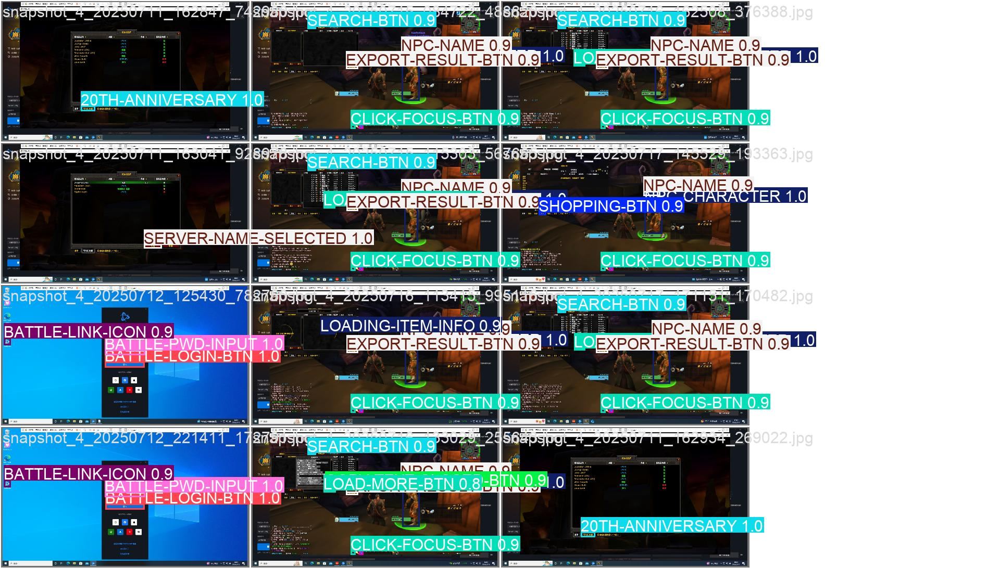
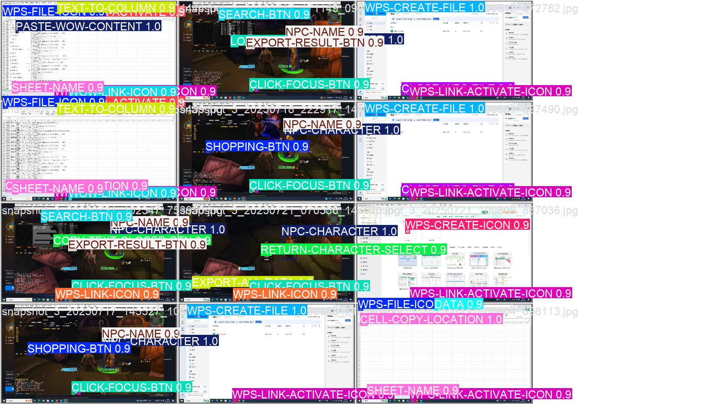

---

### 🤖 自动操作流程

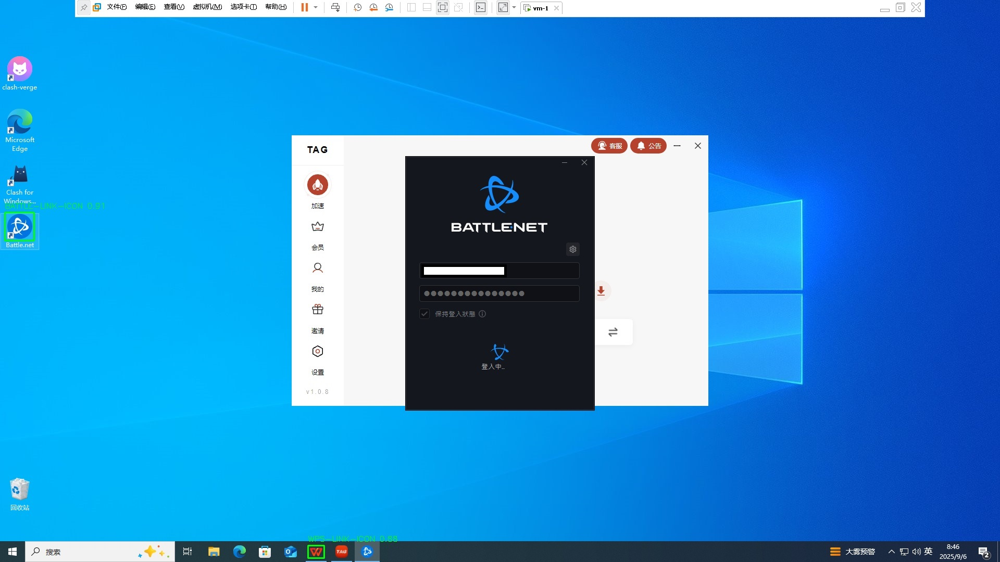
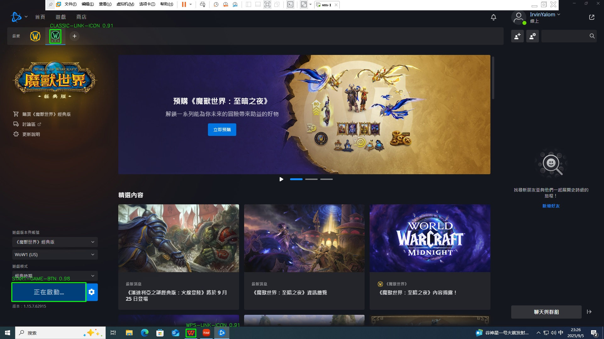
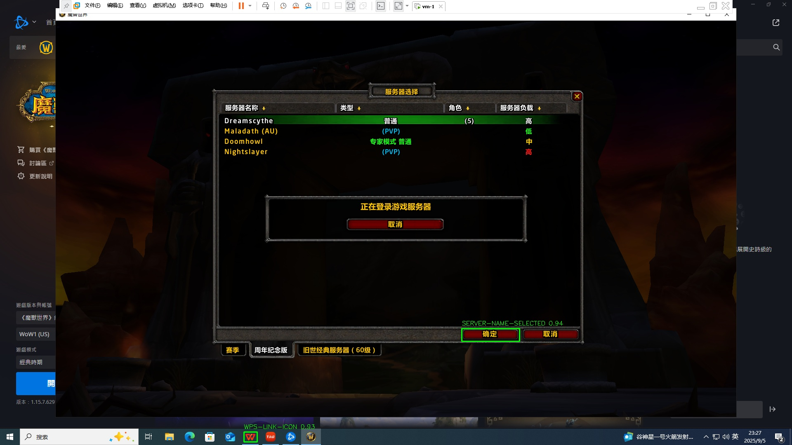
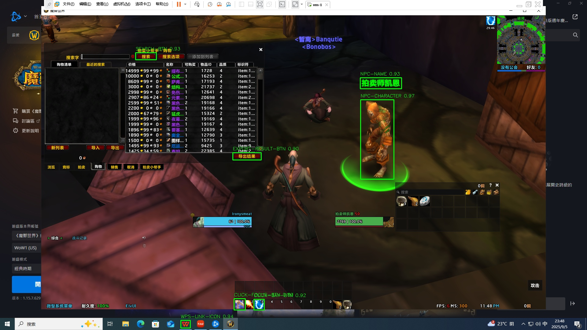
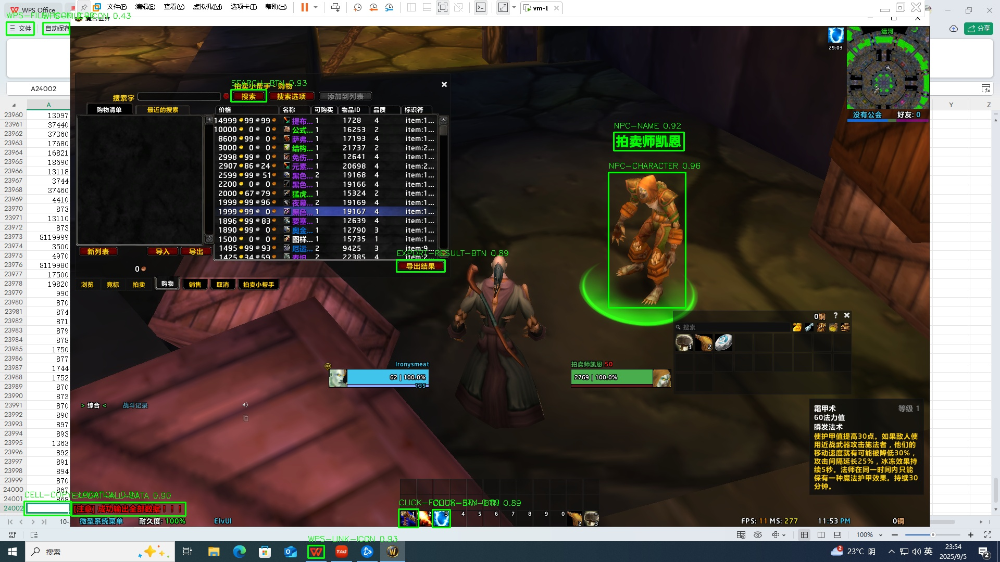
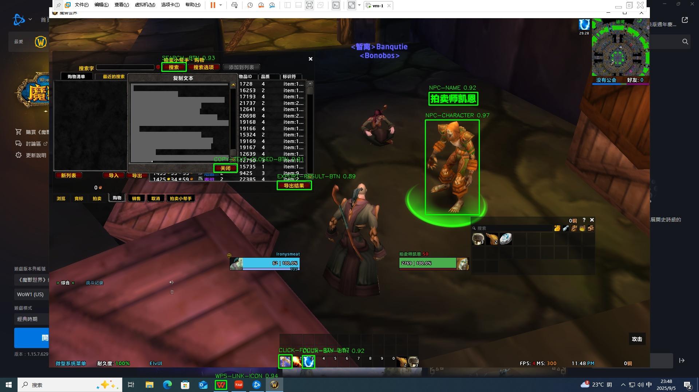
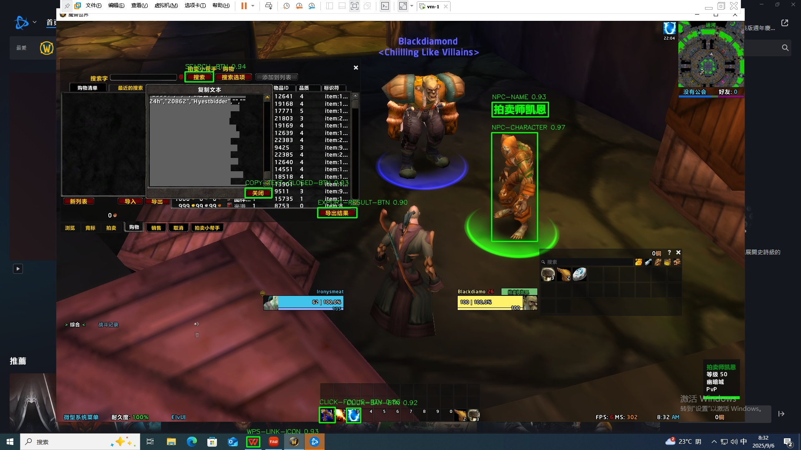
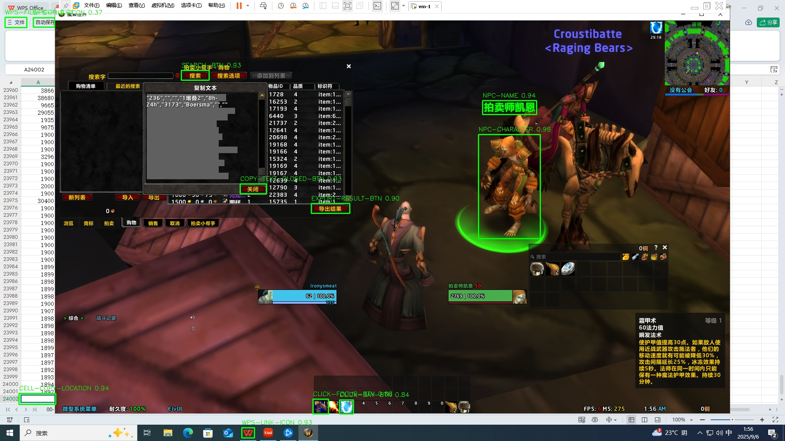
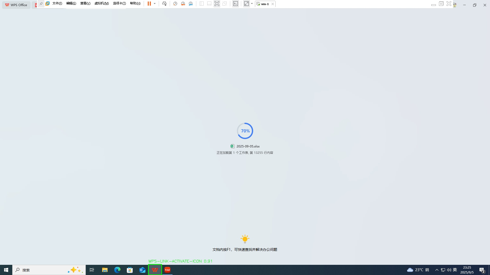
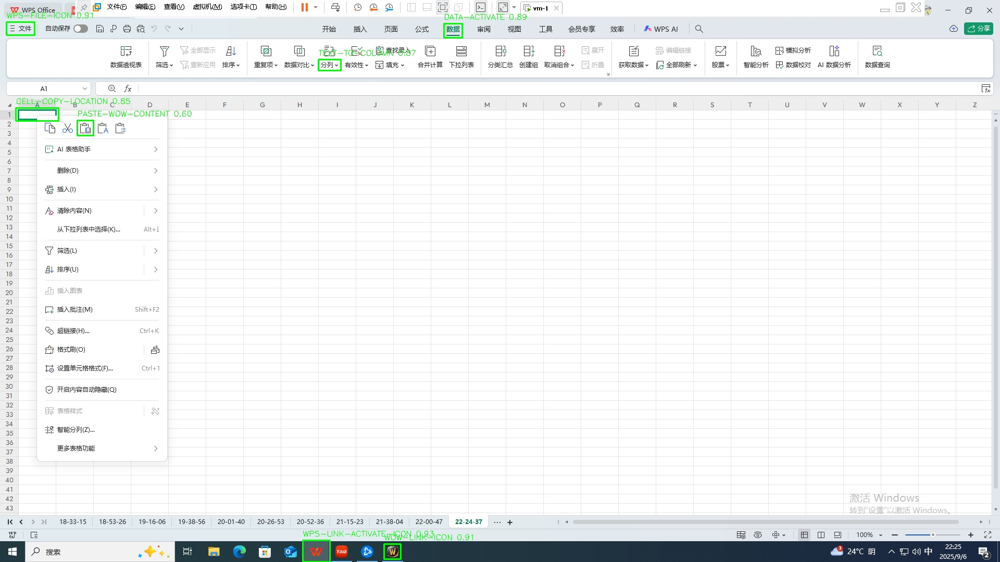
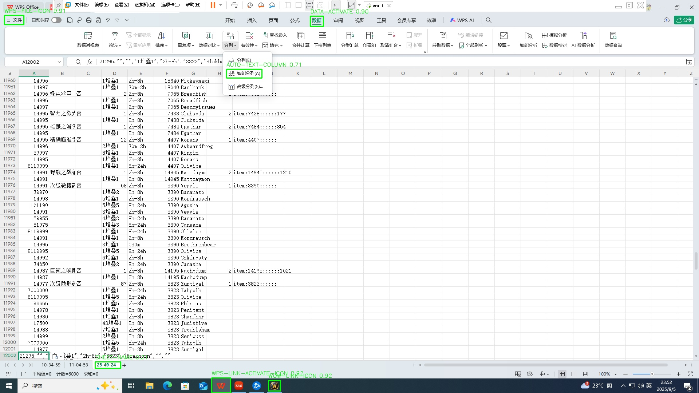
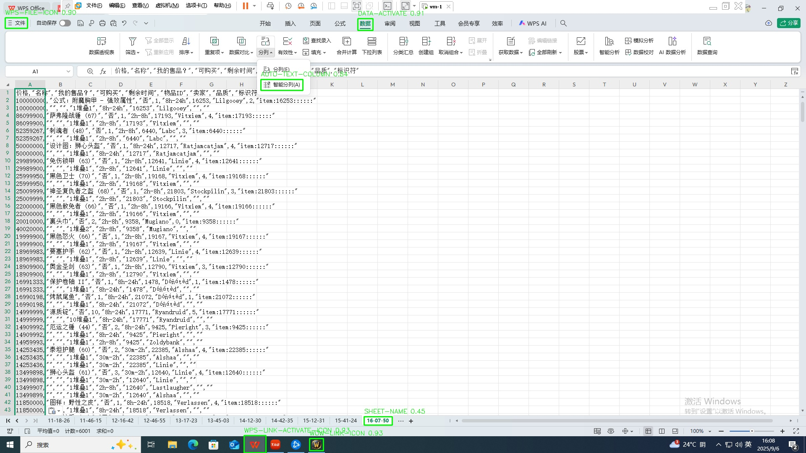
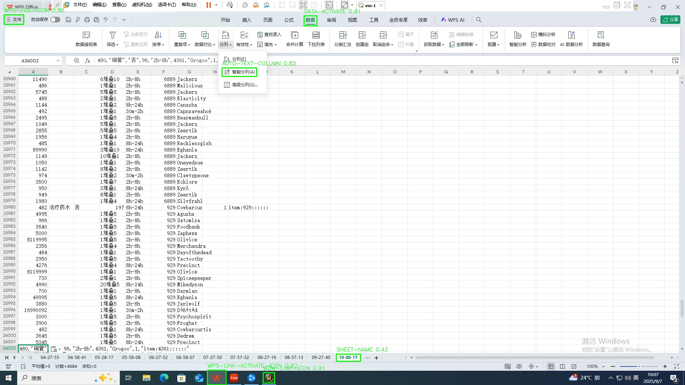

---

### 📊 数据分析结果

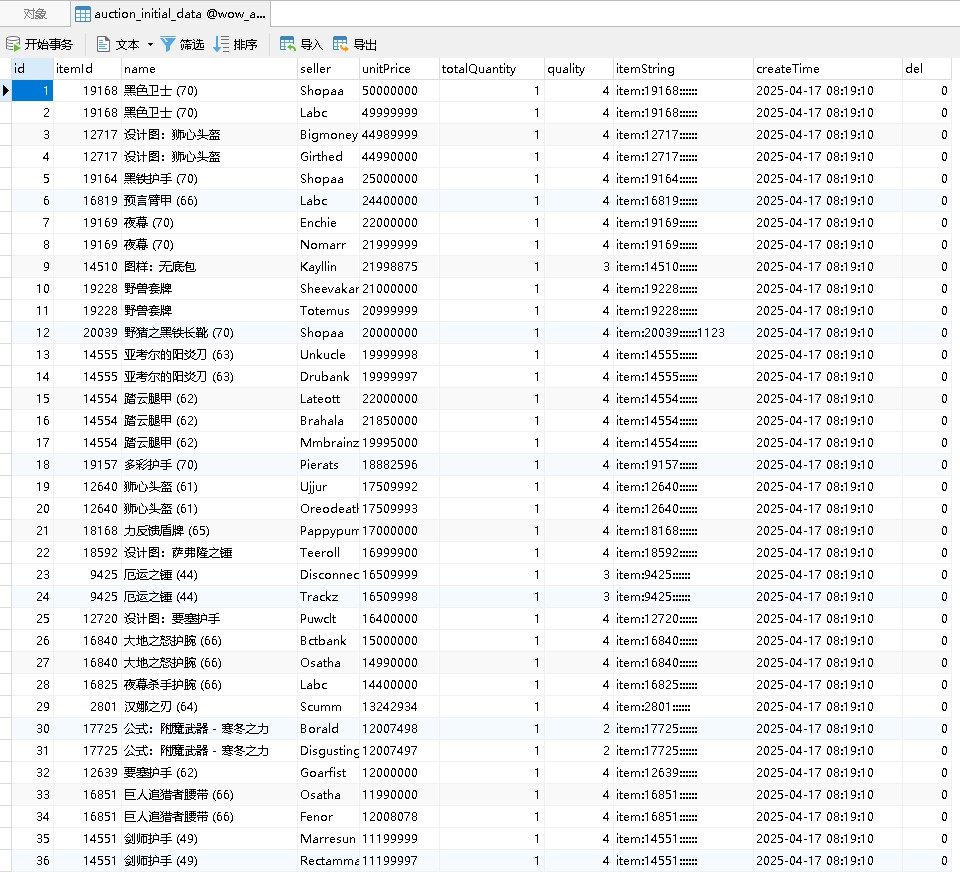
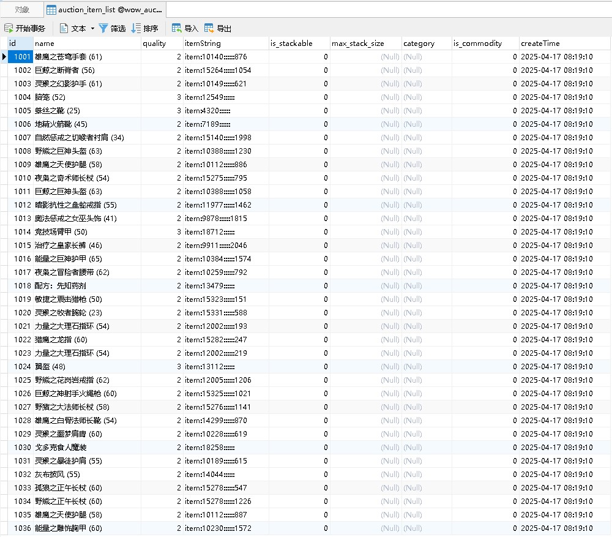

---

## ⚙️ 项目结构

```
wow-auction-ai-system/
│
├── README.md
├── requirements.txt
├── main.py
│
├── screen_capture/      # 屏幕采集
├── model_training/      # YOLO训练
├── automation/          # 自动操作
├── data_processing/     # 数据分析
│
├── docs/                # 截图
```

---

## ⚙️ 模块说明

### 🖥️ screen_capture

实时获取屏幕画面，为AI识别提供输入

---

### 🧠 model_training

基于 YOLOv8 训练模型，实现UI元素识别

---

### 🤖 automation

自动执行游戏操作：

* 登录游戏
* 打开拍卖行
* 搜索商品
* 导出数据

---

### 📊 data_processing

* 解析 Excel 数据
* 分析供需关系
* 计算价格趋势
* 写入数据库

---

## 🛠️ 技术栈

* Python
* YOLOv8
* OpenCV
* PyAutoGUI
* Pandas
* MySQL

---

## ⚠️ 环境要求

* Python 3.9+
* Windows 系统（依赖桌面自动化）
* 推荐 GPU（用于 YOLOv8）

---

## 🚀 安装依赖

```bash
pip install -r requirements.txt
```

---

## ▶️ 运行项目

```bash
python main.py
```

---

## ⚠️ 注意事项

* 本项目依赖固定分辨率（推荐 1920x1080）
* 自动化操作基于屏幕坐标，请确保环境一致
* YOLO模型需提前训练完成

---

## 📦 requirements 说明

* YOLOv8：目标检测
* PyAutoGUI：自动操作
* Pandas：数据分析
* MySQL：数据存储

---

## 🚀 可扩展方向

* AI价格预测模型
* Web可视化（ECharts）
* 多服务器套利系统

---

## ⚠️ 免责声明

本项目仅用于技术研究与学习，请勿用于违反游戏规则的用途。

---

⭐ If you like this project, give it a star!
